# Лабораторная работа: развёртывание веб-приложения в AWS

# 1. Общая информация

**ФИО:** Murzacoi Nichita  
**Группа:** IA2403  
**Приложение:** `open_capsules_php_functional (TimeCapsule)`  
**Вариант деплоя:** B — скрипт `deploy.sh`  
**AWS Region:** `eu-central-1 (Frankfurt)`  
**GitHub Organization:** `nichita-cloud`  
**GitHub Repository:** `timecapsule`

---

# 2. Цель работы

Цель лабораторной работы — получить практические навыки работы с облачной инфраструктурой AWS, создания и настройки экземпляра Amazon EC2, подключения к серверу по SSH, настройки веб-сервера nginx, PHP-FPM и PostgreSQL.

Дополнительно в работе рассматривается размещение исходного кода приложения в GitHub, развёртывание приложения на сервере, автоматизация обновления с помощью скрипта `deploy.sh`, проверка отказа приложения и последующий откат версии.

---

# 3. Задание 1. Подготовка AWS

Для выполнения лабораторной работы был выбран регион:

```text
eu-central-1 (Frankfurt)
```

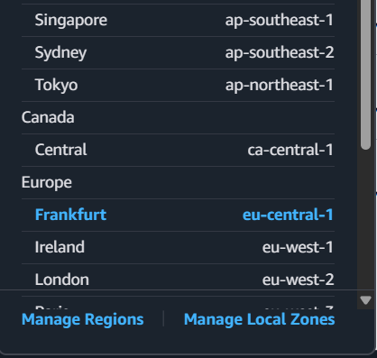

Для повседневной работы был создан IAM-пользователь `cloudstudent`. Также была создана группа `Admins`, которой назначена политика:

```text
AdministratorAccess
```

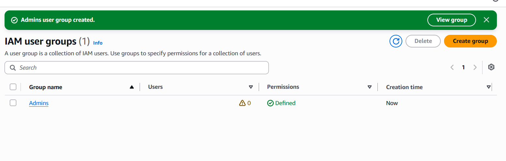

После создания пользователя работа в AWS выполнялась от имени IAM-пользователя `cloudstudent`, а root-пользователь использовался только для первоначальной настройки аккаунта.

Также был создан бюджет:

```text
ZeroSpend
```

с нулевым порогом расходов.

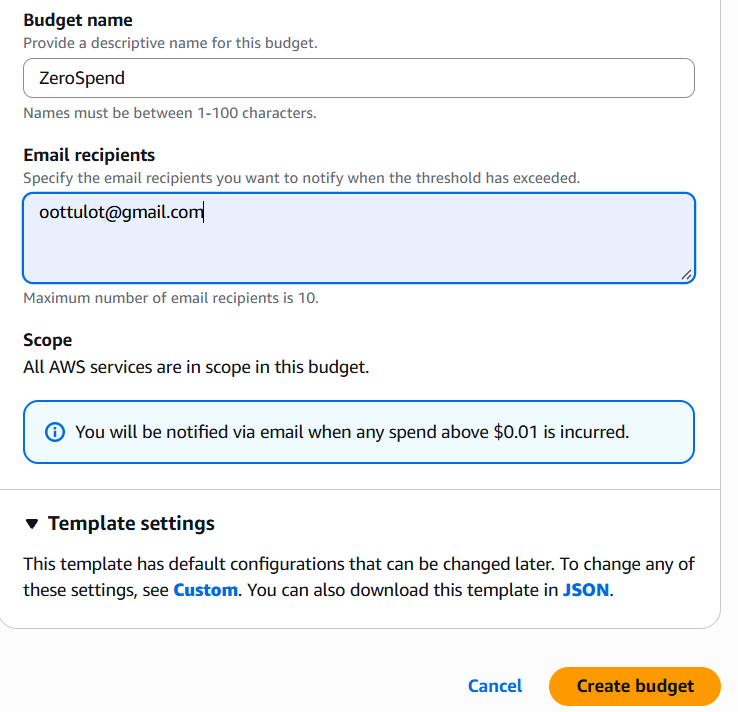


**Рисунок 1 — Настройка IAM и бюджет AWS ZeroSpend**

## Контрольный вопрос

### Что разрешает политика AdministratorAccess?

Политика `AdministratorAccess` предоставляет практически полный доступ к сервисам и ресурсам AWS.

### Почему нельзя постоянно использовать root?

Root-пользователь имеет максимальные права во всём AWS-аккаунте. Поэтому его рекомендуется использовать только для специальных административных действий. Для повседневной работы безопаснее использовать IAM-пользователя.

---

# 4. Задание 2. Запуск экземпляра EC2

Был создан экземпляр EC2 со следующими параметрами:

- **Name:** `webserver`
- **AMI:** `Amazon Linux 2023`
- **Instance type:** `t3.micro`
- **Region:** `eu-central-1`
- **Public IP:** Enabled
- **Security Group:** `webserver-sg`
- **Instance ID:** `i-097567683487b4ecf`
- **Public IPv4:** `63.176.102.205`

Для подключения по SSH была создана пара ключей. После замены ключа использовался файл:

```text
cloudstudent-keypair-new.pem
```

В Security Group были настроены правила:

| Протокол | Порт | Источник |
|---|---:|---|
| SSH | 22 | My IP |
| HTTP | 80 | 0.0.0.0/0 |

Для автоматической установки nginx использовался User Data:

```bash
#!/bin/bash
dnf -y update
dnf -y install htop nginx
systemctl enable --now nginx
```

После запуска экземпляр перешёл в состояние `Running`, а проверки состояния были успешно пройдены.

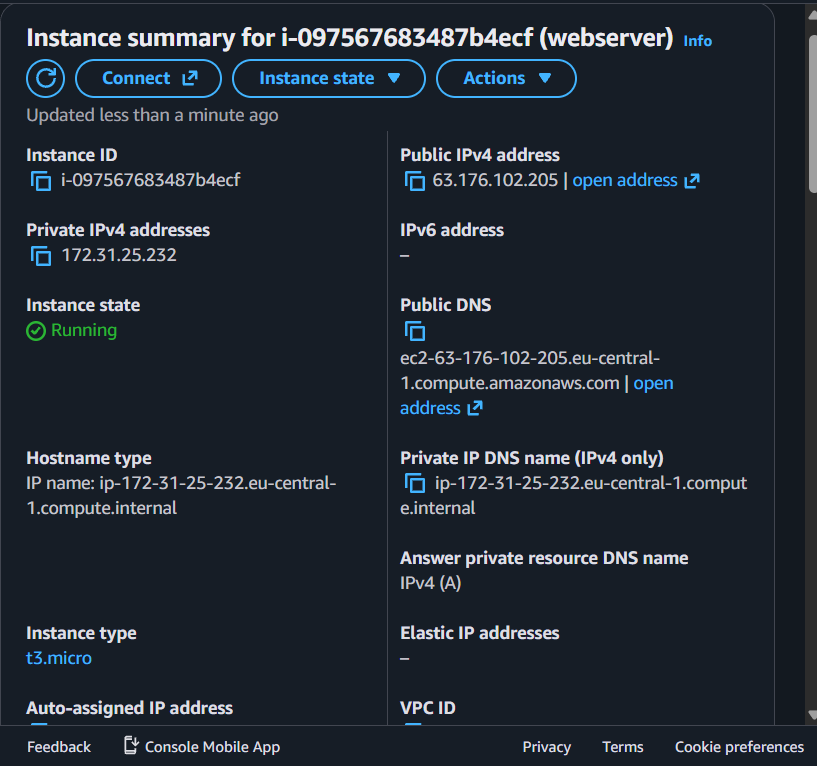

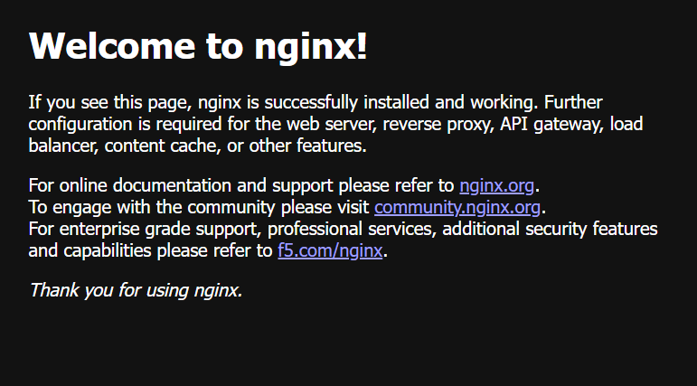

**Рисунок 2 — Запущенный экземпляр EC2**

После запуска nginx стала доступна стандартная страница веб-сервера по адресу:

```text
http://63.176.102.205
```

Страница `Welcome to nginx!` подтвердила, что сервер nginx был установлен и успешно запущен.

## Контрольный вопрос

### Что такое User Data?

User Data позволяет передать экземпляру EC2 скрипт начальной настройки. В данной работе скрипт автоматически обновляет пакеты, устанавливает `htop` и `nginx`, после чего запускает nginx и включает его автозапуск.

### Выполнится ли User Data после обычной перезагрузки?

По умолчанию User Data выполняется при первом запуске экземпляра. При обычной перезагрузке этот скрипт повторно не запускается.

---

# 5. Задание 3. Мониторинг и диагностика

Для экземпляра EC2 были просмотрены:

- `System status check`;
- `Instance status check`;
- `Attached EBS status check`;
- метрики CloudWatch;
- System Log;
- состояние экземпляра.

В разделе `Monitoring` были просмотрены данные о загрузке процессора, сетевой активности и дисковых операциях.

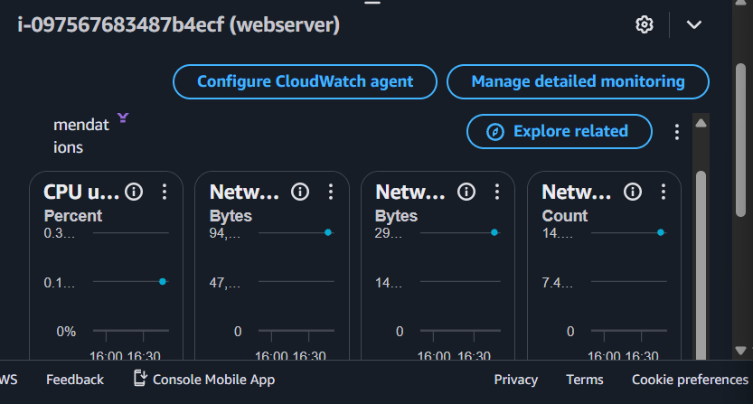

**Рисунок 3 — Мониторинг EC2**

В разделе диагностики были успешно пройдены три проверки состояния экземпляра. В `System Log` были найдены сообщения `cloud-init`, подтверждающие выполнение User Data и установку nginx.

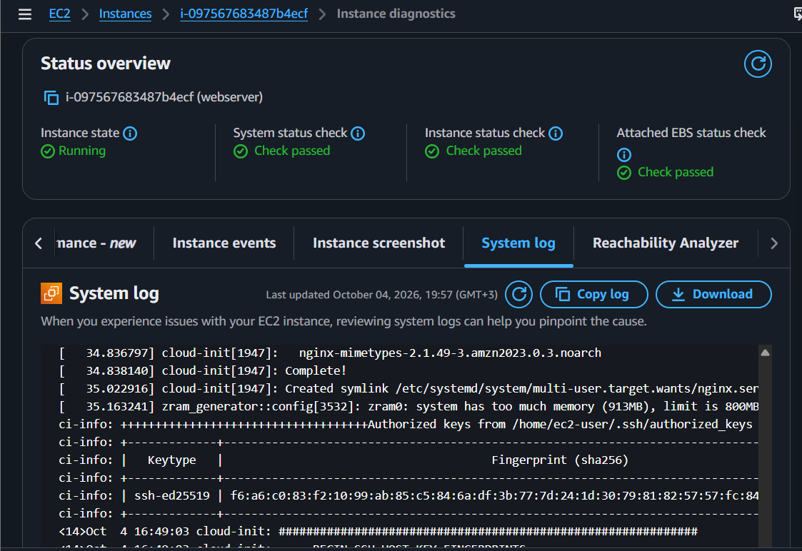

**Рисунок 4 — Проверки состояния и System Log**

## Контрольные вопросы

### Какая проверка показывает проблему пользователя?

`Instance status check` показывает состояние самой виртуальной машины и операционной системы. Если эта проверка не проходит, причина обычно находится внутри экземпляра.

### Какая проверка показывает проблему AWS?

`System status check` относится к инфраструктуре AWS: физическому серверу, сети и другим компонентам платформы.

### Что показывает Attached EBS Status Check?

Эта проверка показывает состояние и доступность подключённых EBS-томов.

### Когда нужен Detailed Monitoring?

Detailed Monitoring полезен, когда необходимо получать метрики чаще и быстрее реагировать на изменение нагрузки. В обычном режиме достаточно базового мониторинга CloudWatch.

---

# 6. Задание 4. Подключение по SSH

Для подключения к экземпляру использовался пользователь:

```text
ec2-user
```

и приватный ключ:

```text
cloudstudent-keypair-new.pem
```

Подключение с локального компьютера выполнялось командой:

```powershell
ssh -i .\cloudstudent-keypair-new.pem ec2-user@63.176.102.205
```

Для работы с новым ключом его публичная часть была получена командой:

```powershell
ssh-keygen -y -f .\cloudstudent-keypair-new.pem
```

Публичный ключ был добавлен в файл:

```text
/home/ec2-user/.ssh/authorized_keys
```

После подключения была выполнена проверка nginx:

```bash
systemctl status nginx
```

Сервис nginx работал в состоянии:

```text
active (running)
```

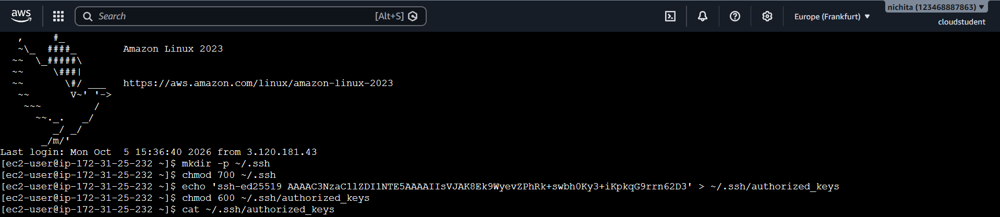
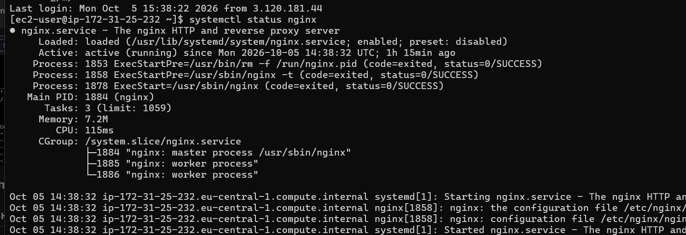

**Рисунок 5 — Подключение к экземпляру и работа с SSH**

## Контрольный вопрос

### Почему используется SSH-ключ?

SSH-ключ позволяет использовать криптографическую аутентификацию без передачи обычного пароля. Приватный ключ хранится у пользователя, а сервер проверяет соответствующий публичный ключ.

---

# 7. Задание 5. Статический сайт

Для проверки работы nginx были подготовлены три HTML-страницы:

```text
index.html
about.html
contact.html
```

Страницы содержали ссылки друг на друга.

Файлы были переданы на экземпляр EC2 командой:

```powershell
scp -i .\cloudstudent-keypair-new.pem index.html about.html contact.html ec2-user@63.176.102.205:~
```
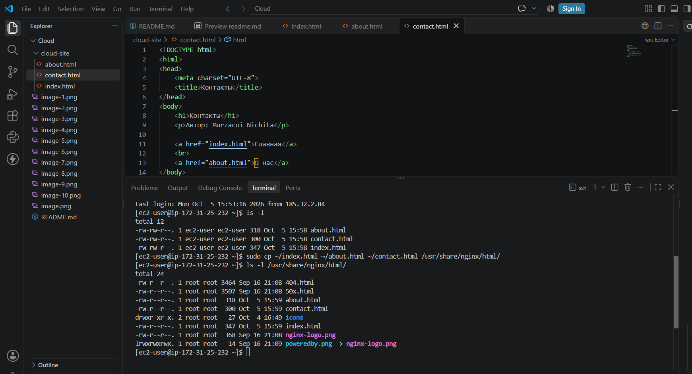
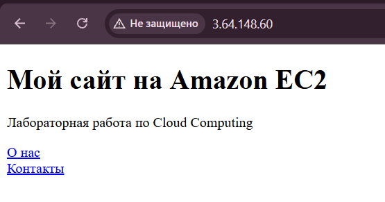
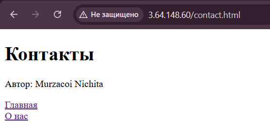
После передачи файлов они были скопированы в директорию, из которой nginx отдаёт статические страницы:

```bash
sudo cp ~/*.html /usr/share/nginx/html/
```

Наличие файлов проверялось командой:

```bash
ls -l /usr/share/nginx/html
```

После этого сайт стал доступен по публичному IP-адресу экземпляра:

```text
http://3.64.148.60/
```

## Контрольный вопрос

### Что делает SCP и чем он похож на SSH?

`scp` используется для безопасной передачи файлов между локальным компьютером и удалённым сервером. Для соединения он использует SSH и тот же механизм аутентификации по ключу.

---

# 8. Задание 6. Остановка экземпляра через AWS CLI

Для управления экземпляром использовался AWS CloudShell. Остановка экземпляра выполнялась командой:

```bash
aws ec2 stop-instances --instance-ids i-097567683487b4ecf --region eu-central-1
```
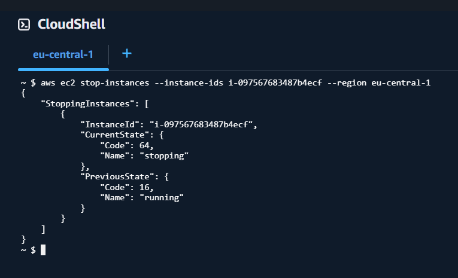
Команда обращается к сервису EC2, указывает идентификатор экземпляра и регион `eu-central-1`.

После выполнения команды экземпляр переходит из состояния `Running` сначала в `Stopping`, а затем в `Stopped`.

## Контрольные вопросы

### Чем Stop отличается от Terminate?

`Stop` временно выключает экземпляр, но сохраняет сам экземпляр и его EBS-диски. Такой экземпляр можно снова запустить.

`Terminate` удаляет экземпляр. После удаления вернуть его обычным запуском уже нельзя.

### За что продолжается оплата после Stop?

После остановки перестаёт начисляться стоимость вычислительных ресурсов экземпляра, однако сохраняемые ресурсы, например EBS-тома, могут продолжать тарифицироваться.

---

# 9. Задание 7. GitHub Organization и репозиторий

Для хранения исходного кода была использована GitHub Organization:

```text
nichita-cloud
```

В организации был создан публичный репозиторий:

```text
timecapsule
```

Для лабораторной работы использовалось приложение:

```text
open_capsules_php_functional
```

Исходный код учебных приложений был получен командой:

```bash
git clone https://github.com/msu-cloud-course/app-samples.git
```

После этого код приложения `open_capsules_php_functional` был перенесён в отдельную папку `timecapsule`, после чего был создан новый Git-репозиторий:

```bash
git init -b main
git add .
git commit -m "Initial import of TimeCapsule"
git remote add origin https://github.com/nichita-cloud/timecapsule.git
git push -u origin main
```
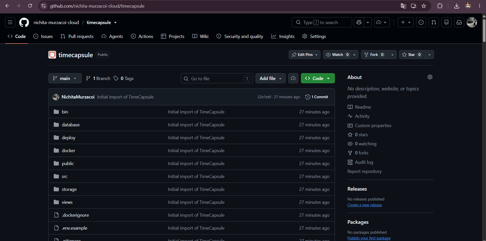
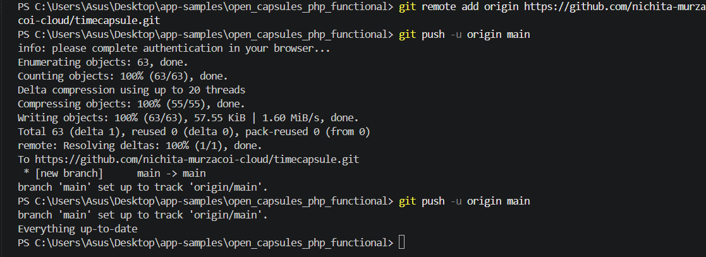

В корне репозитория находятся основные каталоги:

```text
public
src
views
```

и файл:

```text
composer.json
```

Файл `.env` и каталог `vendor/` в репозиторий не добавлялись.

## Контрольный вопрос

### Почему vendor и .env не попадают в GitHub?

Они исключены правилами `.gitignore`. Файл `.env` содержит конфиденциальные параметры, поэтому его нельзя публиковать. Каталог `vendor/` содержит зависимости PHP, которые устанавливаются повторно с помощью Composer.

---

# 10. Задание 8. Подготовка сервера

На экземпляре были установлены компоненты, необходимые для работы TimeCapsule:

```bash
sudo dnf -y install git composer postgresql16-server \
php8.4-fpm php8.4-cli php8.4-pgsql php8.4-mbstring php8.4-xml
```
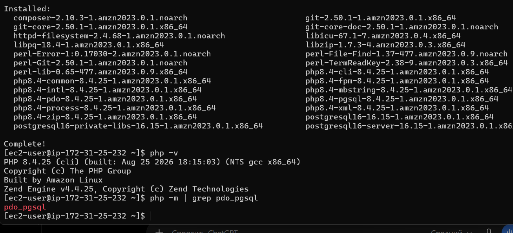
После установки были проверены версия PHP и наличие драйвера PostgreSQL:

```bash
php -v
php -m | grep pdo_pgsql
```

Таким образом были подготовлены Git, Composer, PostgreSQL, PHP-FPM и необходимые расширения PHP.

## Контрольный вопрос

### Почему пакеты устанавливались вручную?

Пакеты продвинутой части устанавливались отдельно после базовой настройки экземпляра. Такой подход позволяет отдельно проверить каждый компонент, необходимый для приложения.

---

# 11. Задание 9. PostgreSQL

Для создания служебных файлов PostgreSQL была выполнена команда:

```bash
sudo postgresql-setup --initdb
```

Затем была просмотрена конфигурация аутентификации:

```bash
sudo grep -v '^#' /var/lib/pgsql/data/pg_hba.conf | grep -v '^$'
```

Метод `ident` был заменён на `scram-sha-256`:

```bash
sudo sed -i 's/ident$/scram-sha-256/' /var/lib/pgsql/data/pg_hba.conf
```

После этого PostgreSQL был запущен и добавлен в автозапуск:

```bash
sudo systemctl enable --now postgresql
```

Для приложения был создан отдельный пользователь и база данных:

```bash
sudo -u postgres psql -c "CREATE USER timecapsule WITH PASSWORD '********';"
sudo -u postgres psql -c "CREATE DATABASE timecapsule OWNER timecapsule;"
```
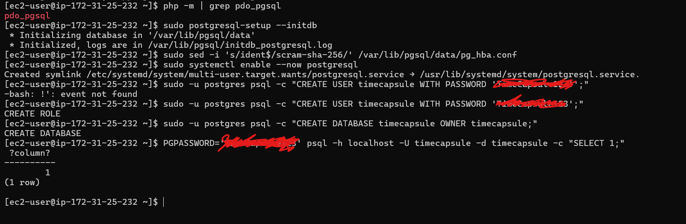
Пароль в отчёте намеренно скрыт.

Подключение к базе было проверено командой:

```bash
psql -h localhost -U timecapsule -d timecapsule -c "SELECT 1;"
```

Успешный вывод числа `1` подтверждает, что пользователь может подключиться к базе данных по паролю.

---

# 12. Задание 10. Развёртывание приложения

Для приложения была создана директория:

```bash
sudo mkdir -p /var/www/timecapsule
sudo chown ec2-user:ec2-user /var/www/timecapsule
```

Код приложения был загружен непосредственно из GitHub:

```bash
git clone https://github.com/nichita-cloud/timecapsule.git /var/www/timecapsule
cd /var/www/timecapsule
```

Для хранения настроек был создан файл `.env`. Он содержал адрес приложения, параметры PostgreSQL и настройки загрузки файлов:

```env
APP_URL=http://63.176.102.205
APP_DEBUG=false

DB_HOST=localhost
DB_PORT=5432
DB_NAME=timecapsule
DB_USER=timecapsule
DB_PASSWORD=********

UPLOAD_DIR=storage/uploads
MAX_UPLOAD_MB=5
MAIL_DELAY_SECONDS=3
AUTH_ENABLED=true
```
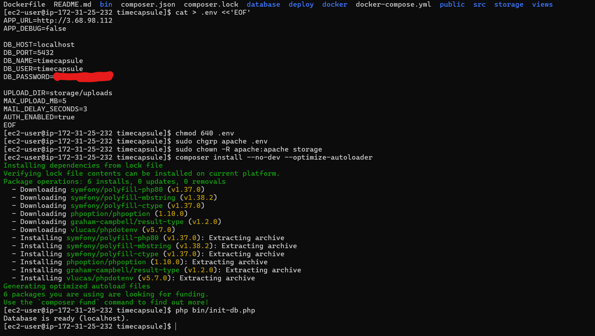
Пароль базы данных в отчёте скрыт.

Для защиты конфигурационного файла и предоставления PHP-FPM доступа к необходимым данным были настроены права:

```bash
chmod 640 .env
sudo chgrp apache .env
sudo chown -R apache:apache storage
```

Зависимости приложения были установлены командой:

```bash
composer install --no-dev --optimize-autoloader
```

Таблицы базы данных были созданы командой:

```bash
php bin/init-db.php
```

## Контрольные вопросы

### Почему пароль хранится в .env?

Пароль базы данных является конфиденциальным параметром и не должен находиться в публичном исходном коде. Файл `.env` хранится непосредственно на сервере и исключён из Git.

### Почему публичный репозиторий безопасен?

В публичном репозитории находится исходный код приложения, но конфиденциальные данные в него не добавляются. Пароли и другие секреты находятся в `.env`.

---

# 13. Задание 11. Настройка PHP-FPM и nginx

Сначала был увеличен допустимый размер загружаемых PHP-файлов:

```bash
sudo sed -i 's/^upload_max_filesize.*/upload_max_filesize = 6M/' /etc/php.ini
```

После этого был создан конфигурационный файл:

```text
/etc/nginx/conf.d/timecapsule.conf
```

со следующей конфигурацией:

```nginx
server {
    listen 80 default_server;
    listen [::]:80 default_server;

    root /var/www/timecapsule/public;
    index index.php;

    client_max_body_size 8M;

    location / {
        try_files $uri /index.php?$query_string;
    }

    location ~ \.php$ {
        try_files $uri =404;
        fastcgi_pass unix:/run/php-fpm/www.sock;
        include fastcgi_params;
        fastcgi_param SCRIPT_FILENAME $document_root$fastcgi_script_name;
    }

    location ~ /\. {
        deny all;
    }
}
```

Конфигурация nginx была проверена:

```bash
sudo nginx -t
```
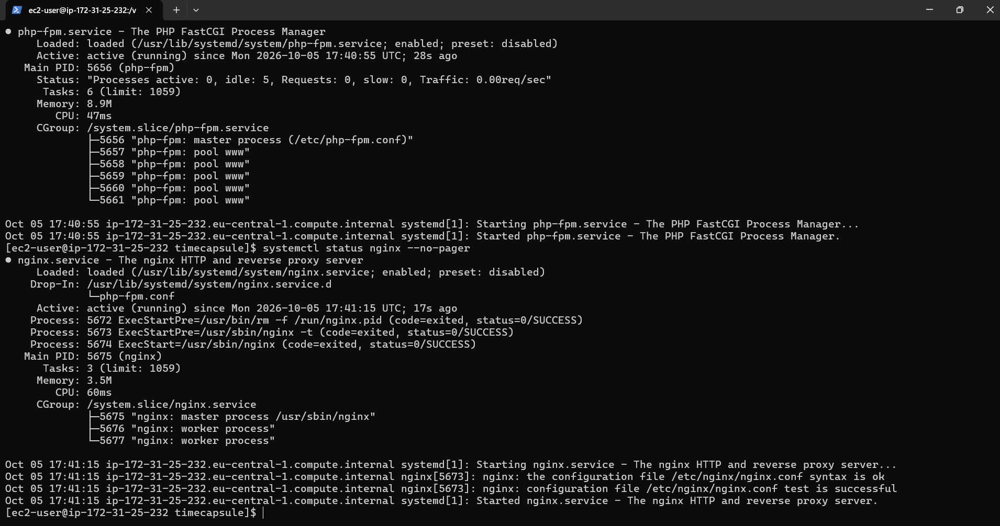
После успешной проверки был запущен PHP-FPM:

```bash
sudo systemctl enable --now php-fpm
```

Затем nginx был перезапущен:

```bash
sudo systemctl restart nginx
```

Работа приложения проверялась по адресу:

```text
http://3.68.98.112/login
```
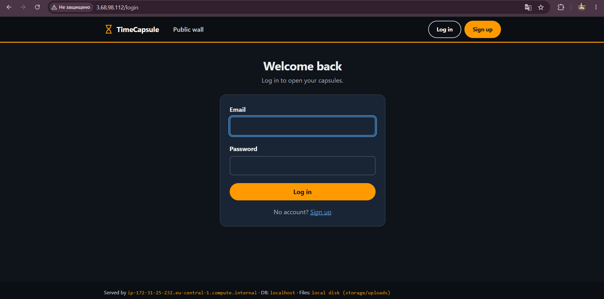
Дополнительно был проверен endpoint:
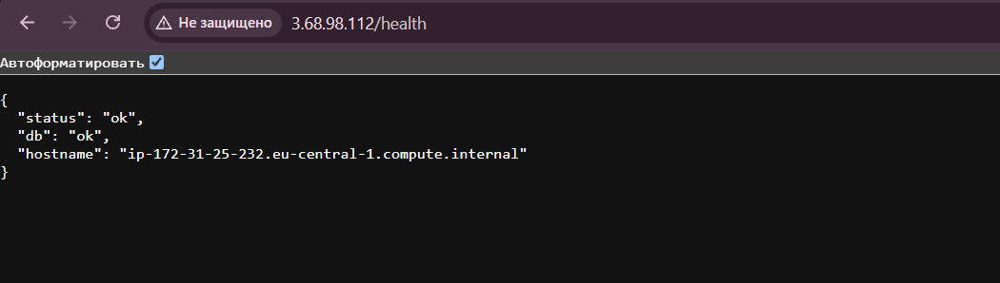
```text
http://3.68.98.112/health
```

Ответ `/health` использовался для проверки работы приложения и соединения с базой данных.

---

# 14. Задание 12. Обновление приложения

Для автоматизации развёртывания был создан файл:

```text
~/deploy.sh
```

со следующим содержимым:

```bash
#!/bin/bash
set -euo pipefail

cd /var/www/timecapsule

echo "==> Забираем новый код из GitHub"
git pull --ff-only

echo "==> Устанавливаем библиотеки"
composer install --no-dev --optimize-autoloader --no-interaction

echo "==> Создаём недостающие таблицы"
php bin/init-db.php

echo "==> Перезапускаем PHP-FPM"
sudo systemctl reload php-fpm

echo "Готово. На сервере коммит: $(git log -1 --oneline)"
```

Скрипту были выданы права на выполнение:

```bash
chmod +x ~/deploy.sh
```

После этого деплой запускался одной командой:

```bash
~/deploy.sh
```

Для запуска непосредственно с локального компьютера использовалась команда:

```powershell
ssh -i .\cloudstudent-keypair-new.pem ec2-user@63.176.102.205 ./deploy.sh
```

Использование `deploy.sh` уменьшает количество ручных действий и делает процесс обновления приложения повторяемым.
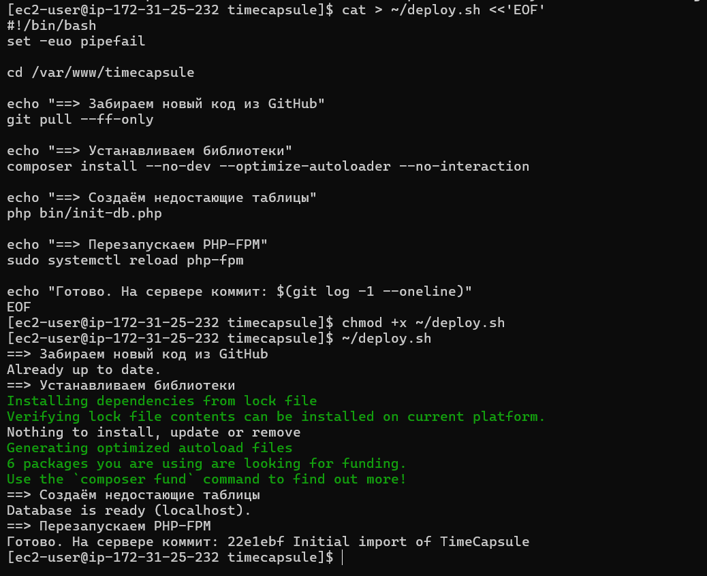
---

# 15. Задание 13. Новая версия, ошибка и откат

## 15.1 Выпуск новой версии

Для проверки процесса обновления в файл:

```text
views/layout.php
```

была добавлена информация об авторе.

Изменение было сохранено в Git:

```bash
git add views/layout.php
git commit -m "Show author in footer"
git push
```

После отправки изменения в GitHub на сервере был выполнен `deploy.sh`. После обновления страницы новая информация появилась в интерфейсе приложения.

## 15.2 Намеренная поломка

Для проверки процедуры восстановления в `views/layout.php` была намеренно добавлена синтаксическая ошибка:

```php
<?php broken(
```

После создания коммита, отправки его в GitHub и повторного деплоя главная страница стала возвращать:

```text
HTTP 500
```
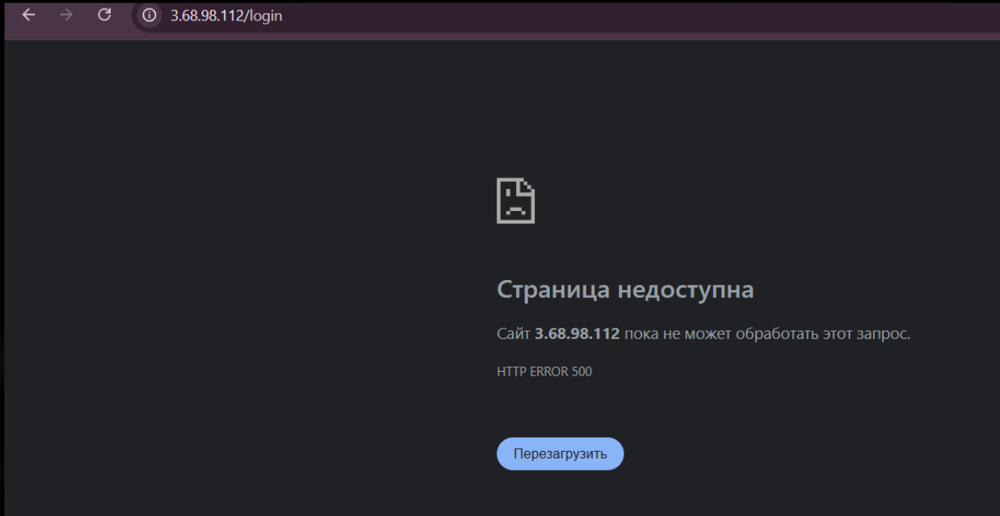
При этом endpoint `/health` продолжал отвечать.

### Почему /health продолжал работать?

Endpoint `/health` проверяет только определённые компоненты приложения, например соединение с базой данных. Успешный ответ `/health` не гарантирует исправность всех страниц и пользовательских сценариев.

## 15.3 Откат

Для отмены ошибочного изменения был создан обратный коммит:

```bash
git revert --no-edit HEAD
git push
```

После повторного запуска:

```bash
~/deploy.sh
```
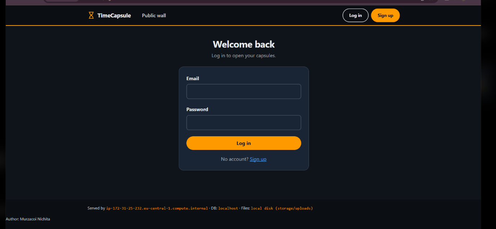
рабочая версия приложения была восстановлена.

### Анализ

Время простоя приложения складывается из времени обнаружения ошибки, определения причины, выполнения отката и повторного деплоя. Сократить простой можно с помощью автоматических тестов, CI/CD и предварительных проверок новой версии.

---

# 16. Задание 14. Архитектура

Развёртывание состоит из AWS-инфраструктуры, сервера приложения, локального компьютера разработчика и внешнего GitHub-репозитория.

Пользователь отправляет HTTP-запрос на публичный IP экземпляра EC2. Запрос принимает nginx. Статические файлы nginx отдаёт самостоятельно, а запросы к PHP передаёт PHP-FPM через Unix-сокет.

PHP-FPM выполняет код приложения TimeCapsule. При необходимости приложение обращается к PostgreSQL, работающему на том же экземпляре EC2.

GitHub находится вне AWS. Разработчик отправляет изменения с локального компьютера в GitHub командой `git push`, а сервер получает новую версию кода через HTTPS при выполнении `git pull`.

Упрощённая цепочка запроса:

```text
Пользователь
    |
    | HTTP
    v
  nginx
    |
    | FastCGI
    v
 PHP-FPM
    |
    v
TimeCapsule
    |
    v
PostgreSQL
```

Процесс доставки кода:

```text
Компьютер разработчика
        |
        | git push
        v
      GitHub
        |
        | git pull по HTTPS
        v
       EC2
```

---

# 17. Architecture Decision Record

Файл ADR:

```text
docs/adr/0001-deploy-method.md
```

## ADR-0001. Способ доставки кода

**Статус:** принято  
**Дата:** 2026-10-04

### Контекст

Приложение TimeCapsule необходимо разворачивать на EC2 и регулярно обновлять. Требовалось выбрать способ доставки исходного кода на сервер с учётом простоты, контроля версий и повторяемости процесса.

### Решение

Для развёртывания выбран скрипт `deploy.sh`.

Скрипт выполняет:

- получение новой версии кода из GitHub;
- установку PHP-зависимостей;
- инициализацию недостающих таблиц;
- перезагрузку PHP-FPM;
- вывод текущего Git-коммита.

### Рассмотренные альтернативы

#### 1. SCP

`scp` позволяет напрямую копировать файлы с компьютера на сервер.

Преимущество — простота при небольшом количестве файлов.

Недостаток — сложно контролировать версии приложения и легко забыть передать отдельный файл.

#### 2. Ручной git pull

Сервер получает код непосредственно из GitHub с помощью `git pull`.

Этот вариант лучше `scp` с точки зрения контроля версий, но после получения кода необходимо вручную выполнять дополнительные команды.

#### 3. deploy.sh

Скрипт объединяет все действия в одну повторяемую процедуру и уменьшает вероятность пропустить один из этапов.

### Последствия

Положительным результатом является простой и повторяемый процесс деплоя. Версия приложения определяется Git-коммитом.

Недостаток состоит в том, что полноценная CI/CD-система отсутствует: деплой всё ещё запускается вручную, а автоматические тесты перед выпуском не выполняются.

---

# 18. Ответы на дополнительные контрольные вопросы

## 18.1 Как проходит запрос от браузера до базы данных?

Браузер отправляет HTTP-запрос на публичный IP EC2. nginx принимает запрос. Статические файлы он возвращает самостоятельно, а PHP-запросы передаёт PHP-FPM.

PHP-FPM выполняет код TimeCapsule, после чего приложение при необходимости обращается к PostgreSQL.

```text
Browser
   |
   v
nginx
   |
   v
PHP-FPM
   |
   v
TimeCapsule
   |
   v
PostgreSQL
```

## 18.2 Почему сервер может скачать код, но не может отправить изменения?

Репозиторий является публичным, поэтому сервер может получить код через HTTPS без аутентификации.

При этом серверу не предоставлены данные для записи в репозиторий. Это безопаснее, поскольку компрометация EC2 не должна автоматически давать возможность изменять исходный код в GitHub.

## 18.3 Что произойдёт с файлами после удаления EC2?

В данной архитектуре пользовательские файлы находятся на локальном хранилище экземпляра. При удалении экземпляра вместе с его EBS-томом эти данные могут быть потеряны.

Для реального production-приложения пользовательские файлы целесообразно хранить отдельно от EC2.

## 18.4 Что общего между deploy.sh и CI/CD?

`deploy.sh` автоматизирует последовательность действий для выпуска новой версии: получение кода, установку зависимостей, работу с базой и перезагрузку приложения.

Это упрощённый вариант процесса CI/CD. В выполненной работе отсутствуют автоматический запуск после `git push`, автоматические тесты, проверки качества кода и полноценный pipeline.

---

# 19. Итог

В ходе лабораторной работы был подготовлен AWS-аккаунт, создан IAM-пользователь `cloudstudent`, настроена группа `Admins` с политикой `AdministratorAccess` и создан бюджет `ZeroSpend`.

В регионе `eu-central-1 (Frankfurt)` был создан экземпляр EC2 `webserver` на базе Amazon Linux 2023. Для экземпляра была настроена Security Group, открыт HTTP-доступ и настроено SSH-подключение. Через User Data был установлен и запущен nginx.

Были изучены средства мониторинга и диагностики Amazon EC2, включая CloudWatch, System status check, Instance status check, Attached EBS status check и System Log.

Для приложения TimeCapsule был подготовлен GitHub-репозиторий. На сервере были установлены Git, Composer, PHP-FPM и PostgreSQL, создана база данных и настроено взаимодействие приложения с nginx и PHP-FPM.

Для обновления приложения использовался скрипт `deploy.sh`. Также был рассмотрен процесс выпуска новой версии, возникновения ошибки и восстановления рабочей версии с помощью `git revert`.

В результате была рассмотрена полная схема развёртывания веб-приложения, в которой GitHub используется как источник исходного кода, а экземпляр EC2 работает как сервер приложения с nginx, PHP-FPM и PostgreSQL.

---

# 20. Список использованных источников

1. Методические материалы лабораторной работы по AWS.
2. Документация AWS EC2.
3. Документация AWS IAM.
4. Документация Amazon CloudWatch.
5. Документация AWS CLI.
6. Документация Git и GitHub.
7. Документация nginx.
8. Документация PHP и PHP-FPM.
9. Документация PostgreSQL.
